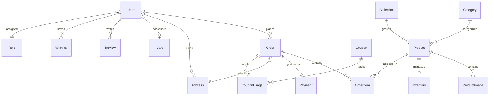

# THALF Enterprise Architecture & PostgreSQL Backend Documentation

---

## 1. Database ER Diagram & Relational Model



---

## 2. Prisma Schema Specification

- **PostgreSQL Engine**: Relational model with foreign key constraints, indexes on foreign keys (`userId`, `orderNumber`, `slug`), soft-delete flag (`isDeleted`), and decimal precision (`Decimal(10,2)`).
- **Core Models (22 total)**: `User`, `Role`, `Address`, `Product`, `Category`, `Collection`, `ProductImage`, `Inventory`, `Order`, `OrderItem`, `Payment`, `Coupon`, `CouponUsage`, `Cart`, `CartItem`, `Wishlist`, `Review`, `Notification`, `Media`, `HomepageCMS`, `Settings`, `AuditLog`, `AdminUser`.

---

## 3. Clean Architecture Folder Mapping

```
UI Component (React)
    ↓ (User Event)
Server Actions / Route Handlers (`src/app/api/v1/...`)
    ↓ (Request Object)
Controllers (`src/controllers/product.controller.ts`)
    ↓ (Zod Validation)
Services (`src/services/order.service.ts`)
    ↓ (Business Rules & ACID Transactions)
Repositories (`src/repositories/inventory.repository.ts`)
    ↓ (Prisma Queries)
Prisma ORM (`src/lib/prisma.ts`)
    ↓ (SQL)
PostgreSQL Database
```

---

## 4. RESTful API Documentation

| Method | Route | Description | Auth Required |
| :--- | :--- | :--- | :--- |
| `GET` | `/api/v1/products` | Paginated product listing with filters | Public |
| `GET` | `/api/v1/products/:id` | Detailed product payload by ID | Public |
| `POST` | `/api/v1/orders` | Place new order & lock stock atomically | Customer |
| `POST` | `/api/v1/payments/verify` | Verify Razorpay payment HMAC signature | Customer |
| `POST` | `/api/v1/payments/webhook` | Razorpay event webhook reconciliation | Webhook Signature |
| `POST` | `/api/v1/admin/products` | Create product (Admin) | Admin RBAC |

---

## 5. Better Auth Authentication & RBAC Flow

1. Customer/Admin signs in via credentials or email link.
2. Better Auth validates hash and issues secure HTTP-Only cookie `better-auth.session_token`.
3. `middleware/auth.ts` intercepts requests to `/admin/*` or `/api/admin/*`, validating role permissions (`ADMIN`, `SUPER_ADMIN`, `CONCIERGE`).

---

## 6. Order Flow & Lifecycle

```
[Customer Bag] ➔ [Checkout Form] ➔ [OrderService.createOrder()]
                                          │
                        ┌─────────────────┴─────────────────┐
                        ▼                                   ▼
          [Reserve Inventory Stock]               [Calculate GST & Shipping]
                        │                                   │
                        └─────────────────┬─────────────────┘
                                          ▼
                         [Create Order (Status: PENDING)]
                                          │
                                          ▼
                      [Generate Razorpay Payment Order ID]
```

---

## 7. Payment Verification & Webhook Architecture

- Frontend initiates Razorpay Checkout Modal with server-generated `razorpayOrderId`.
- Upon completion, Razorpay returns `razorpay_payment_id` & `razorpay_signature`.
- Server calculates `crypto.createHmac('sha256', secret).update(orderId + '|' + paymentId)`.
- If signatures match:
  1. Payment status set to `CAPTURED`.
  2. Order status updated to `CONFIRMED`.
  3. Reserved stock permanently deducted from inventory table.

---

## 8. ACID Inventory Stock Engine

- Inventory updates run inside Prisma `$transaction` blocks.
- **Stock Reservation**: `reservedStock = reservedStock + quantity` (Fails if `stockQuantity - reservedStock < quantity`).
- **Payment Success**: `stockQuantity = stockQuantity - quantity`, `reservedStock = reservedStock - quantity`.
- **Payment Failure / Timeout**: `reservedStock = reservedStock - quantity`.

---

## 9. Admin Portal Architecture

- Role-based permissions (`ADMIN`, `SUPER_ADMIN`, `CONCIERGE`).
- Full Audit Logging (`AuditLog` model tracking user ID, IP address, target entity, and timestamp).

---

## 10. Deployment Architecture

- **Database**: PostgreSQL hosted on Supabase / Railway / AWS RDS with connection pooling (`PgBouncer`).
- **Application**: Next.js 15 hosted on Vercel App Router Serverless Functions.
- **Media**: Cloudinary CDN for optimized image transformation.

---

## 11. Security Architecture

- **SQL Injection**: Prevented by Prisma parameterized queries.
- **Input Validation**: Enforced at controller boundary via Zod (`z.object()`).
- **Rate Limiting**: Configured via Upstash Redis.
- **CSRF Protection**: HTTP-Only SameSite SameOrigin cookies.

---

## 12. Scaling Strategy

- **Upstash Redis Caching**: Cache catalog query responses (`/api/v1/products`).
- **Read Replicas**: Direct query routing for high-traffic read operations.
- **Static Pre-rendering**: ISR for high-volume product detail pages.
